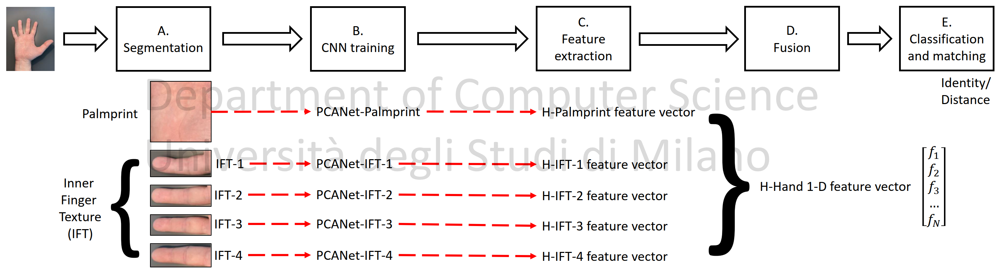

<div align="center">

# 🤝 FusionNet

### Touchless Palmprint and Finger Texture Recognition with Deep Learning Feature Fusion

[](https://www.mathworks.com/products/matlab.html)
[](LICENSE)
[](https://ieeexplore.ieee.org/document/9071620)
[](http://iebil.di.unimi.it/fusionnet/index.htm)
[](https://github.com/AngeloUNIMI/Demo_FusionNet)

**Source code for the IEEE CIVEMSA 2019 paper**  
*Touchless palmprint and finger texture recognition: A Deep Learning fusion approach*

</div>

---

## 🧠 Overview

**FusionNet** is a MATLAB implementation of a touchless biometric recognition pipeline that combines two complementary hand traits acquired from the same palmar image:

- **Palmprint**
- **Inner Finger Texture (IFT)**

The method extracts multiple Regions of Interest (ROIs), trains the same deep learning topology on each biometric trait, and performs **feature-level fusion** to improve recognition performance without requiring additional acquisitions.

---

## ✨ Key Ideas

- 🖐️ Single touchless hand acquisition
- 🌴 Palmprint ROI extraction
- ☝️ Inner Finger Texture ROI extraction
- 🧬 Deep feature extraction with a PCANet-inspired architecture
- 🔗 Feature-level fusion across palm and finger texture representations
- 📊 Biometric evaluation for touchless and less-constrained recognition

---

## 📌 Pipeline

<div align="center">



</div>

```text
Touchless hand image
        │
        ▼
Database processing
        │
        ▼
Palmprint and IFT ROI extraction
        │
        ├───────────────┬───────────────┬───────────────┐
        ▼               ▼               ▼               ▼
  Palmprint ROI      IFT-1 ROI        IFT-2 ROI        IFT-n ROI
        │               │               │               │
        ▼               ▼               ▼               ▼
 Deep feature     Deep feature     Deep feature     Deep feature
 extraction       extraction       extraction       extraction
        │               │               │               │
        └───────────────┴───────────────┴───────────────┘
                        │
                        ▼
                Feature-level fusion
                        │
                        ▼
              Matching and evaluation
```

---

## 📁 Repository Structure

```text
FusionNet/
│
├── main_FusionNet.m                    # Main script
├── README.md                           # Project documentation
├── LICENSE                             # GPL-3.0 license
│
├── (0) Common functions/               # Shared utility functions
├── (A) Process DB files/               # Dataset loading and preprocessing
├── (B) ROI extraction/                 # Palmprint and finger texture ROI extraction
├── (C) PCANet_featureFusion/           # Deep feature extraction and fusion routines
│
└── images/
    ├── outline.png                     # Pipeline illustration
    └── DB Fusion Palm-Knuckle (orig)/
        └── REST_hand_database/         # Expected REST dataset location
```

---

## 🚀 Getting Started

### 1. Clone the repository

```bash
git clone https://github.com/AngeloUNIMI/FusionNet.git
cd FusionNet
```

### 2. Prepare the REST hand database

Download the REST hand database from the official provider and place it in:

```text
./images/DB Fusion Palm-Knuckle (orig)/REST_hand_database/
```

The expected folder structure is:

```text
images/DB Fusion Palm-Knuckle (orig)/REST_hand_database/p1
images/DB Fusion Palm-Knuckle (orig)/REST_hand_database/p2
images/DB Fusion Palm-Knuckle (orig)/REST_hand_database/p3
...
```

Each `pX` folder should contain the corresponding hand images for that subject.

### 3. Run FusionNet

Open MATLAB, move to the repository folder, and run:

```matlab
main_FusionNet
```

---

## 📊 Output

FusionNet performs the main stages required for touchless palmprint and finger texture fusion:

| Stage | Description |
|---|---|
| Database processing | Reads and organizes REST hand images |
| ROI extraction | Extracts palmprint and Inner Finger Texture regions |
| Feature extraction | Computes deep features using the PCANet-inspired pipeline |
| Fusion | Combines palmprint and IFT information at feature level |
| Evaluation | Computes biometric recognition performance |

---

## 🧪 Dataset

The experiments are based on the **REST hand database**:

| Dataset | Link |
|---|---|
| REST Hand Database | http://www.regim.org/publications/databases/regim-sfax-tunisian-hand-database2016-rest2016/ |

---

## 🖥️ Demo Version

A demonstration version of FusionNet for webcam-based touchless palmprint and finger texture recognition is available here:

```text
https://github.com/AngeloUNIMI/Demo_FusionNet
```

---

## 📚 Related Code and Dependencies

FusionNet includes or uses code inspired by the following works and libraries:

- T. Chan, K. Jia, S. Gao, J. Lu, Z. Zeng, and Y. Ma,  
  **“PCANet: A Simple Deep Learning Baseline for Image Classification?”**  
  *IEEE Transactions on Image Processing*, 2015.  
  DOI: `10.1109/TIP.2015.2475625`

- A. Vedaldi and B. Fulkerson,  
  **“VLFeat: An Open and Portable Library of Computer Vision Algorithms”**, 2008.  
  http://www.vlfeat.org/

- Peter Kovesi,  
  **MATLAB and Octave Functions for Computer Vision and Image Processing**.  
  https://www.peterkovesi.com/matlabfns/

---

## 📖 Paper

If you use this code, please cite:

```bibtex
@InProceedings{civemsa19,
  author    = {A. Genovese and V. Piuri and F. Scotti and S. Vishwakarma},
  title     = {Touchless palmprint and finger texture recognition: A Deep Learning fusion approach},
  booktitle = {Proc. of the 2019 IEEE Int. Conf. on Computational Intelligence and Virtual Environments for Measurement Systems and Applications (CIVEMSA 2019)},
  address   = {Tianjin, China},
  month     = {June},
  day       = {14--16},
  year      = {2019},
  pages     = {1--6},
  doi       = {10.1109/CIVEMSA45640.2019.9071620},
  isbn      = {978-1-5386-8344-6}
}
```

Paper:

```text
https://ieeexplore.ieee.org/document/9071620
```

Project page:

```text
http://iebil.di.unimi.it/fusionnet/index.htm
```

---

## 👥 Authors

- **Angelo Genovese**
- **Vincenzo Piuri**
- **Fabio Scotti**
- **Sarvesh Vishwakarma**

---

## 📄 License

This project is released under the **GNU General Public License v3.0**.

See the [LICENSE](LICENSE) file for details.
